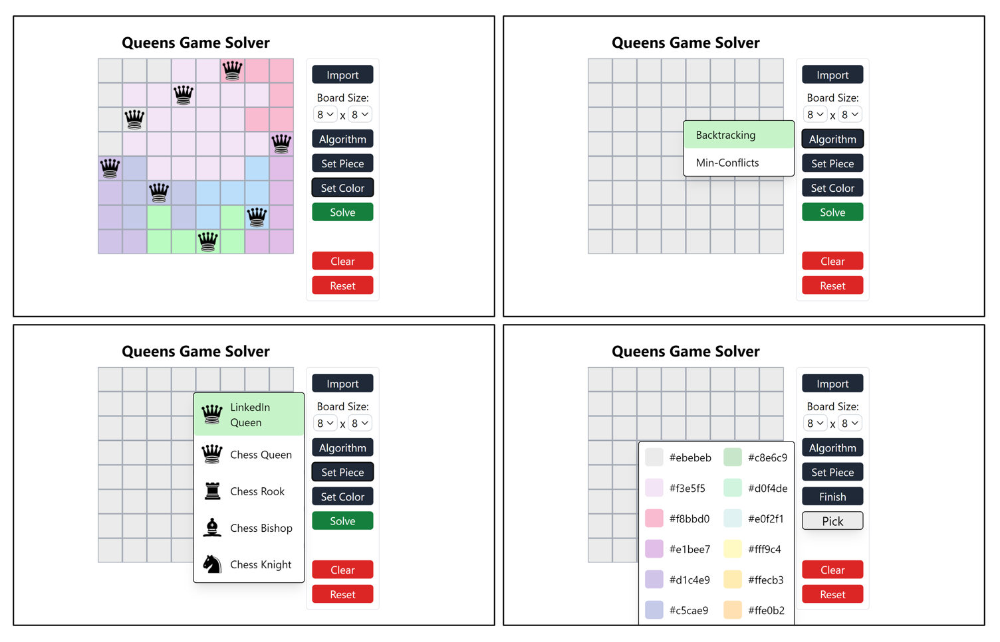

# Queens Game Solver
> Task 2 Seleksi Lab IRK - Ahmad Rafi Maliki 13522137

## Deskripsi

Aplikasi ini merupakan solver untuk permainan [Queens](https://www.linkedin.com/games/queens/) oleh LinkedIn. Aplikasi ini dapat diakses pada [https://13522137-queens-game.vercel.app/](https://13522137-queens-game.vercel.app/). 

## Teknologi Yang Digunakan

### Bahasa Pemrograman:
1. HTML
2. CSS
3. JavaScript
   
### Framework:
1. ViteReact
2. TailwindCSS
   
### Deployment:
1. Vercel

## Struktur Program
```
src/ 
├── node_modules/ 
├── public/ 
├── src/ 
│        ├── assets/ 
│        ├── class/ 
│        ├── components/ 
│        ├── logic/ 
│        ├── App.jsx 
│        ├── main.jsx 
│        ├── App.css
│        └── index.css 
├── .gitignore 
├── package.json 
├── README.md 
└── vite.config.js
```

## Algoritma

1. Backtracking
Algoritma yang digunakan untuk mencari solusi pada Queens Game adalah algoritma Backtracking. Algoritma ini bagus untuk digunakan pada permasalahan ini karena dapat mencegah penelusuran ke simpul yang invalid. Sehingga solusi dapat ditemukan dalam waktu yang cukup cepat.

Permasalahan permaianan ini dimodelkan dalam bentuk struktur data pohon, berikut langkahnya:
1. Langkah pertama dalam mencari solusi adalah mengelompokan seluruh square/tiles pada papan catur berdasarkan warna
2. Hapus kelompok warna yang sudah memiliki queen
3. Lakukan pemodelan pohon untuk sisa kelompok warna lainnya, dengan tiap warna mewakili simpul pohon pada kedalaman yang berbeda (Contoh: warna putih = depth 0, warna merah = depth 1, = warna hijau = depth 2, dst)
4. Lalu akan dijalankan algoritma backtracking secara rekursif dengan model depth first search dari simpul akar.
5. Di setiap simpul baru yang dijelajahi akan dicek apakah queens yang diletakan pada square tersebut merupakan valid, jika ya maka pencarian akan diperdalam, jika tidak maka simpul tersebut akan dimatikan dan tidak akan di telusuri lebih lanjut dan pencarian dilanjutkan dengan model backtracking ke atas.
6. Jika pada pencarian sudah mencapai daun (kedalaman milik kelompok warna terakhir) dan state papan bernilai valid maka nilai true akan dikembalikan dan jalur tersebut merupakan solusi dari permasalahan.
7. Jika seluruh kemungkinan sudah ditelusuri namun tidak ada state papan yang valid maka, false dikembalikan dan solusi tidak ada.

2. Min-Conflicts
Penyelesaian menggunakan pendekatan algoritma ini mengelompokan tiap square sesuai warnanya dan mencari posisi valid untuk meletakan sebuah piece pada kelompok warna tersebut, berikut langkahnya:
1. Langkah pertama dalam mencari solusi adalah mengelompokan seluruh square/tiles pada papan catur berdasarkan warna
2. Hapus kelompok warna yang sudah memiliki queen
3. Letakan sebuah queen secara random pada tiap kelompok warna (misal indeks 0)
5. Lakukan iterasi untuk tiap kelompok warna, cek apakah queen pada kelompok warna tersebut memiliki konflik dengan queen lainnya pada papan, jika iya, simpan kelompok warna tersebut.
6. Jika tidak ditemukan kelompok warna yang memiliki queen konflik maka solusi telah ditemukan
7. Jika ditemukan, maka pilih satu kelompok warna secara random dan lakukan iterasi untuk tiap square pada kelompok warna tersebut dan cari square dengan total konflik paling kecil, kemudian pindahkan queen ke square tersebut.
8. Ulangi langakah 5 sampai maxIterasi (dalam kasus ini saya buat 10.000 kali iterasi) atau sampai solusi ditemukan.

## Cara menjalankan program

1. Clone project dan install dependency
```
git clone https://github.com/rafimaliki/13522137-QueensGame-Seleksi_IRK
cd 13522137-QueensGame-Seleksi_IRK/src
npm i
```
2. Jalankan development server
```
npm run dev
```
3. Akses frontend
```
http://localhost:5173/
```

## Cara menggunakan program



Pengguna dapat mengklik square/tiles untuk meletakan piece catur

Tombol:
1. "Import"
   Pengguna dapat meng-import struktur papan menggunakan file .txt dengan format sebagai berikut
    Contoh:
    <br>
    4 5<br>
    3<br>
    A A A @ @<br>
    A A 2 @ @<br>
    A 2 2 2 @<br>
    2 2 2 2 @<br>

    Baris pertama merupakan dimensi papan (baris, kolom)
    Baris kedua merupakan jumlah warna pada papan
    Baris sisanya merupakan matrix papan dimana tiap karakter merepresentasikan sebuah warna

2. "Board Size"
   Untuk mengubah dmensi papan
   
3. "Algorithm"
   Untuk mengubah algoritma yang digunakan
   
4. "Set Piece"
   Untuk mengubah piece catur yang digunakan
   
5. "Set Color"
   Untuk mengubah warna papan. Setelah memilih warna, pengguna dapat langsung mengklik square/tiles untuk mengubah warnanya. Tekan tombol "Finish" jika sudah selesai dan mau keluar dari mode mengubah warna.
   
6. "Solve"
   Untuk memanggil fungsi pencarian solusi
   
7. "Clear"
    Untuk menghapus semua piece catur yang telah diletakan
    
8. "Reset"
   Untuk mengembalikan papan ke kondisi default


## Referensi Belajar

[Website Rinaldi Munir](https://informatika.stei.itb.ac.id/~rinaldi.munir/Matdis/2023-2024/matdis23-24.htm) <br>
[Min-Conflicts Algorithm](https://en.wikipedia.org/wiki/Min-conflicts_algorithm)
